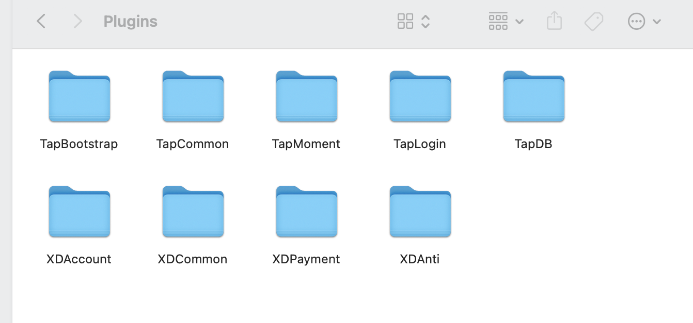

## XDSDK-UE4配置

#### 1.添加Plugins文件夹里的插件


#### 2. 跟对接人员申请xd client id 以及申请开通防沉迷的实名认证配置

#### 3.配置
把 `XDGCommon/Source/XDCommon/XDCommon_iOS_UPL.xml` 里的 `CFBundleURLSchemes`值配置成自己的参数。


## 接口使用

#### 对外接口在 `XDCommonBPLibrary.h` `XDAccountBPLibrary.h` `XDPaymentBPLibrary.h` 中

```
初始化SDK，用申请的xd client id 初始化，0横屏，1竖屏
UFUNCTION(BlueprintCallable, Category = "XDCommon")
static void InitSDK(FString clientID, int orientation);

//单点类型登录，国内只有三种类型： Default自动登录，Guest游客登录，TapTap Tap登录
先自动登录，自动登录失败再显示tap按钮手动点击登录
UFUNCTION(BlueprintCallable, Category = "XDAccount")
static void LoginByType(FString loginType);

//sdk 自带弹框登录
UFUNCTION(BlueprintCallable, Category = "XDAccount")
static void Login();

//退出登录
UFUNCTION(BlueprintCallable, Category = "XDAccount")
static void Logout();

//获取用户
UFUNCTION(BlueprintCallable, Category = "XDAccount")
static void GetUser();

//打开个人中心
UFUNCTION(BlueprintCallable, Category = "XDAccount")
static void OpenUserCenter(); 

//打开账号注销页面
UFUNCTION(BlueprintCallable, Category = "XDAccount") 
static void AccountCancellation(); 

//苹果支付
UFUNCTION(BlueprintCallable, Category = "XDPayment")  
static void PayWithProduct(FString orderId,
                            FString productId,
                            FString roleId,
                            FString serverId,
                            FString ext);
                            
//安卓网页支付
UFUNCTION(BlueprintCallable, Category = "XDPayment")  
static void  PayWithWeb(FString orderId,
                FString productId,
                FString productName,
                float payAmount,
                FString roleId,
                FString serverId,
                FString ext);

//iOS 查询苹果商品信息
UFUNCTION(BlueprintCallable, Category = "XDPayment")
static void QueryWithProductIdArray(TArray<FString> productIds);  

检查补款，无弹框UI
UFUNCTION(BlueprintCallable, Category = "XDPayment")
static void CheckRefundStatus();

检查补款，SDK自带弹框
UFUNCTION(BlueprintCallable, Category = "XDPayment")
static void CheckRefundStatusWithUI();

//获取SDK版本号
UFUNCTION(BlueprintCallable, Category = "XDCommon")
static FString GetSDKVersionName();

是否初始化
UFUNCTION(BlueprintCallable, Category = "XDCommon")
static bool IsInitialized();

设置tapdb信息
UFUNCTION(BlueprintCallable, Category = "XDCommon")
static void Report(FString serverId, FString roleId, FString roleName);

//登录成功，进入前台 调用，开始轮询上报防沉迷时间
UFUNCTION(BlueprintCallable, Category = "XDCommon")
static void EnterGame();  

//退出登录，进入后台 调用，停止轮询上报防沉迷时间
UFUNCTION(BlueprintCallable, Category = "XDCommon")
static void LeaveGame(); 

//获取防沉迷的年龄段
UFUNCTION(BlueprintCallable, Category = "XDCommon")
static int GetAntiAddictionAgeRange(); 

//登录成功后是要，tap db user统计
UFUNCTION(BlueprintCallable, Category = "XDCommon")
static void TrackUser(FString userId); 

UFUNCTION(BlueprintCallable, Category = "XDCommon")
static void TrackRole(FString serverId, FString roleId, FString roleName, int32 level); //角色埋点

UFUNCTION(BlueprintCallable, Category = "XDCommon")    
static void TrackEvent(FString eventName); //事件埋点

UFUNCTION(BlueprintCallable, Category = "XDCommon")
static void TrackAchievement(); //成就埋点

UFUNCTION(BlueprintCallable, Category = "XDCommon")
static void EventCompletedTutorial(); //完成新手指引埋点

UFUNCTION(BlueprintCallable, Category = "XDCommon")
static void EventCreateRole(); //创建角色埋点


```
#### 2.回调在 `XDCommon.h`  `XDPayment.h` 中

```
DECLARE_MULTICAST_DELEGATE_OneParam(FXDSDKInitCompleted, const bool);
DECLARE_MULTICAST_DELEGATE_TwoParams(FXDSDKLoginCompleted, const int32, const FString&);
DECLARE_MULTICAST_DELEGATE_TwoParams(FXDSDKGetUserCompleted, const int32, const FString&);
DECLARE_MULTICAST_DELEGATE(FXDSDKLogoutSuccess);
DECLARE_MULTICAST_DELEGATE(FXDSDKSwitchAccount);
DECLARE_MULTICAST_DELEGATE(FXDSDKAgreeProtocol);
DECLARE_MULTICAST_DELEGATE(FXDSDKInterruptByRealName);
DECLARE_MULTICAST_DELEGATE(FXDSDKBindSuccess);
DECLARE_MULTICAST_DELEGATE(FXDSDKUnBindSuccess);

UPROPERTY(BlueprintAssignable, Category = "XDCommon")
static FXDSDKInitCompleted OnXDSDKInitCompleted;

UPROPERTY(BlueprintAssignable, Category = "XDCommon")
static FXDSDKLoginCompleted OnXDSDKLoginCompleted;

UPROPERTY(BlueprintAssignable, Category = "XDCommon")
static FXDSDKGetUserCompleted OnXDSDKGetUserCompleted;

UPROPERTY(BlueprintAssignable, Category = "XDCommon")
static FXDSDKLogoutSuccess OnXDSDKLogoutSuccess;

UPROPERTY(BlueprintAssignable, Category = "XDCommon")
static FXDSDKSwitchAccount OnXDSDKSwitchAccount;

UPROPERTY(BlueprintAssignable, Category = "XDCommon")
static FXDSDKAgreeProtocol OnXDSDKAgreeProtocol;

UPROPERTY(BlueprintAssignable, Category = "XDCommon")
static FXDSDKInterruptByRealName OnXDSDKInterruptByRealName;

UPROPERTY(BlueprintAssignable, Category = "XDCommon")
static FXDSDKBindSuccess OnXDSDKBindSuccess;

UPROPERTY(BlueprintAssignable, Category = "XDCommon")
static FXDSDKUnBindSuccess OnXDSDKUnBindSuccess;  


DECLARE_MULTICAST_DELEGATE_FourParams(FXDSDKPaymentSucceed, const FString&, const FString&, const FString&, const FString&);
DECLARE_MULTICAST_DELEGATE_TwoParams(FXDSDKPaymentFailed, const int32, const FString&);
DECLARE_MULTICAST_DELEGATE_OneParam(FXDSDKQueryProductIdsSucceed, const FString&);
DECLARE_MULTICAST_DELEGATE_TwoParams(FXDSDKQueryProductIdsFailed, const int32, const FString&);
DECLARE_MULTICAST_DELEGATE_OneParam(FXDSDKQueryRestoredPurchasesSucceed, const FString&);
DECLARE_MULTICAST_DELEGATE_TwoParams(FXDSDKQueryRestoredPurchasesFailed, const int32, const FString&);
DECLARE_MULTICAST_DELEGATE_OneParam(FXDSDKCheckRefundStatusSucceed, const FString&);
DECLARE_MULTICAST_DELEGATE_TwoParams(FXDSDKCheckRefundStatusFailed, const int32, const FString&);
DECLARE_MULTICAST_DELEGATE_TwoParams(FXDSDKPayWithWebCompleted, const int32, const FString&);

UPROPERTY(BlueprintAssignable, Category = "XDPayment")
static FXDSDKPaymentSucceed OnXDSDKPaymentSucceed;

UPROPERTY(BlueprintAssignable, Category = "XDPayment")
static FXDSDKPaymentFailed OnXDSDKPaymentFailed;

UPROPERTY(BlueprintAssignable, Category = "XDPayment")
static FXDSDKQueryProductIdsSucceed OnXDSDKQueryProductIdsSucceed;

UPROPERTY(BlueprintAssignable, Category = "XDPayment")
static FXDSDKQueryProductIdsFailed OnXDSDKQueryProductIdsFailed;

UPROPERTY(BlueprintAssignable, Category = "XDPayment")
static FXDSDKQueryRestoredPurchasesSucceed OnXDSDKQueryRestoredPurchasesSucceed;

UPROPERTY(BlueprintAssignable, Category = "XDPayment")
static FXDSDKQueryRestoredPurchasesFailed OnXDSDKQueryRestoredPurchasesFailed;

UPROPERTY(BlueprintAssignable, Category = "XDPayment")
static FXDSDKCheckRefundStatusSucceed OnXDSDKCheckRefundStatusSucceed;

UPROPERTY(BlueprintAssignable, Category = "XDPayment")
static FXDSDKCheckRefundStatusFailed OnXDSDKCheckRefundStatusFailed;

UPROPERTY(BlueprintAssignable, Category = "XDPayment")
static FXDSDKPayWithWebCompleted OnXDSDKPayWithWebCompleted;
```

#### 3.接口使用及回调可参考 `Source/Demo/DemoGameModeBase.h`  和 `Source/Demo/DemoGameModeBase.cpp`文件

`DemoGameModeBase.h`参考如下：
```
//Common
virtual void BeginPlay() override;

void OnXDSDKInitCompleted(const bool);

void OnXDSDKLoginCompleted(const int32, const FString&);

void OnXDSDKGetUserCompleted(const int32, const FString&);

void OnXDSDKLogoutSuccess();

void OnXDSDKSwitchAccount();

void OnXDSDKAgreeProtocol();

void OnXDSDKInterruptByRealName();

void OnXDSDKBindSuccess();

void OnXDSDKUnBindSuccess();

//Payment 
void OnXDSDKPaymentSucceed(const FString&, const FString&, const FString&, const FString&);

void OnXDSDKPaymentFailed(const int32, const FString&);

void OnXDSDKQueryProductIdsSucceed(const FString&);

void OnXDSDKQueryProductIdsFailed(const int32, const FString&);

void OnXDSDKQueryRestoredPurchasesSucceed(const FString&);

void OnXDSDKQueryRestoredPurchasesFailed(const int32, const FString&);

void OnXDSDKCheckRefundStatusSucceed(const FString&);

void OnXDSDKCheckRefundStatusFailed(const int32, const FString&);

void OnXDSDKPayWithWebCompleted(const int32, const FString&);
```

`DemoGameModeBase.cpp`部分代码参考如下：
```
//Common
FXDCommonModule::OnXDSDKInitCompleted.AddUObject(this, &ADemoGameModeBase::OnXDSDKInitCompleted);

FXDCommonModule::OnXDSDKLoginCompleted.AddUObject(this, &ADemoGameModeBase::OnXDSDKLoginCompleted);

FXDCommonModule::OnXDSDKGetUserCompleted.AddUObject(this, &ADemoGameModeBase::OnXDSDKGetUserCompleted);

FXDCommonModule::OnXDSDKLogoutSuccess.AddUObject(this, &ADemoGameModeBase::OnXDSDKLogoutSuccess);

FXDCommonModule::OnXDSDKSwitchAccount.AddUObject(this, &ADemoGameModeBase::OnXDSDKSwitchAccount);

FXDCommonModule::OnXDSDKAgreeProtocol.AddUObject(this, &ADemoGameModeBase::OnXDSDKAgreeProtocol);

FXDCommonModule::OnXDSDKInterruptByRealName.AddUObject(this, &ADemoGameModeBase::OnXDSDKInterruptByRealName);

FXDCommonModule::OnXDSDKBindSuccess.AddUObject(this, &ADemoGameModeBase::OnXDSDKBindSuccess);

FXDCommonModule::OnXDSDKUnBindSuccess.AddUObject(this, &ADemoGameModeBase::OnXDSDKUnBindSuccess);

// //Payment
FXDPaymentModule::OnXDSDKPaymentSucceed.AddUObject(this, &ADemoGameModeBase::OnXDSDKPaymentSucceed);

FXDPaymentModule::OnXDSDKPaymentFailed.AddUObject(this, &ADemoGameModeBase::OnXDSDKPaymentFailed);

FXDPaymentModule::OnXDSDKQueryProductIdsSucceed.AddUObject(this, &ADemoGameModeBase::OnXDSDKQueryProductIdsSucceed);

FXDPaymentModule::OnXDSDKQueryProductIdsFailed.AddUObject(this, &ADemoGameModeBase::OnXDSDKQueryProductIdsFailed);

FXDPaymentModule::OnXDSDKQueryRestoredPurchasesSucceed.AddUObject(this, &ADemoGameModeBase::OnXDSDKQueryRestoredPurchasesSucceed);

FXDPaymentModule::OnXDSDKQueryRestoredPurchasesFailed.AddUObject(this, &ADemoGameModeBase::OnXDSDKQueryRestoredPurchasesFailed);

FXDPaymentModule::OnXDSDKCheckRefundStatusSucceed.AddUObject(this, &ADemoGameModeBase::OnXDSDKCheckRefundStatusSucceed);

FXDPaymentModule::OnXDSDKCheckRefundStatusFailed.AddUObject(this, &ADemoGameModeBase::OnXDSDKCheckRefundStatusFailed);

FXDPaymentModule::OnXDSDKPayWithWebCompleted.AddUObject(this, &ADemoGameModeBase::OnXDSDKPayWithWebCompleted);

void ADemoGameModeBase::OnXDSDKInitCompleted(const bool success){
    GEngine->AddOnScreenDebugMessage(-1, 10.f, FColor::Red,  TEXT("Init Result: " + FString::FromInt(success)));
}

void ADemoGameModeBase::OnXDSDKLoginCompleted(const int32 code, const FString& result){
   if (code == 1){
        GEngine->AddOnScreenDebugMessage(-1, 10.f, FColor::Red, TEXT("Success: " + result));
   }else if(code == 0){
        GEngine->AddOnScreenDebugMessage(-1, 10.f, FColor::Red, TEXT("Fail: " + result));
   }else{
        GEngine->AddOnScreenDebugMessage(-1, 10.f, FColor::Red, TEXT("Cancel: " + result));
   }
}

void ADemoGameModeBase::OnXDSDKGetUserCompleted(const int32 code, const FString& result){
     if (code == 1){
        GEngine->AddOnScreenDebugMessage(-1, 10.f, FColor::Red, TEXT("Success: " + result));
   }else{
        GEngine->AddOnScreenDebugMessage(-1, 10.f, FColor::Red, TEXT("Fail"));
   }
}

void ADemoGameModeBase::OnXDSDKLogoutSuccess(){
    GEngine->AddOnScreenDebugMessage(-1, 10.f, FColor::Red, TEXT("Logout Success"));
}

```
